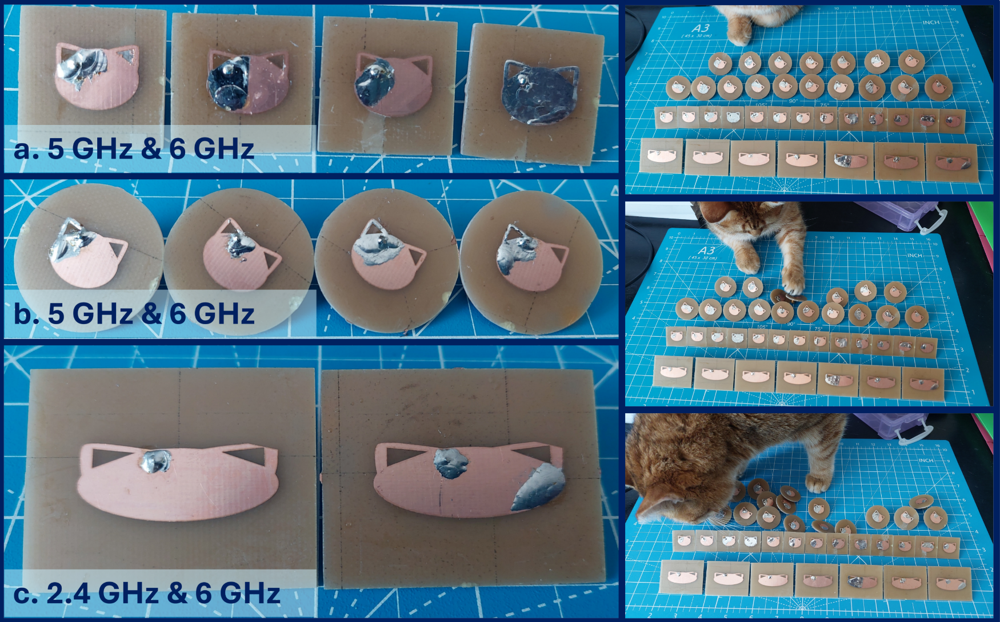

# research_antenna_collection
Collected measurements and designs for antennas that have appeared in papers

## Table of Contents
* [Cat Antennas](#cat-antennas)
* [Related Publications and Repositories](#related-publications-and-repositories)

## Cat Antennas

 

These antennas are modified oval patch antennas on FR4 with permittivity of ~4.4. They are designed to operate at two independent and tunable frequencies. 

**General design summary:**
* Probe-fed design with full copper ground plane
* The two frequencies are independently tunable
    * One frequency is from cheek-to-cheek
    * The second frequency is from head-to-chin
* Little preference is shown in simulation for which orientation is the lower frequency
* Variation in solder 'calico spots' do not impact the design
* Design is impacted more by the probe location in relation to the left ear
* The dual frequencies are better balanced on a round ground plane (not unexpected)
    * Hand cut and milled board outlines measured similarly

|![]|![] |
|:-:|:-:|
|Electric Field, 5 GHz Band |Electric Field, 6 GHz Band|

## Related Publications and Repositories

**Cat Antennas**

[1] L. Linkous, J. Lundquist, M. J. Suche and E. Topsakal, "AntennaCAT: Automated antenna design with machine learning-assisted optimization [Open Source]," in IEEE Antennas and Propagation Magazine, vol. 67, no. 3, pp. 87-96, June 2025, doi: 10.1109/MAP.2025.3560851
[2] L. Linkous, “Machine Learning Assisted Optimization for Calculation and Automated Tuning of Antennas,” VCU Scholars Compass, 2024, doi: https://doi.org/10.25772/ND02-0830.
[3] L. Linkous and E. Topsakal, "Machine Learning Assisted Optimization Methods for Automated Antenna Design," 2024 United States National Committee of URSI National Radio Science Meeting (USNC-URSI NRSM), Boulder, CO, USA, 2024, pp. 377-378, doi: 10.23919/USNC-URSINRSM60317.2024.10464597.
[4] L. Linkous, J. Lundquist and E. Topsakal, "AntennaCAT: Automated Antenna Design and Tuning Tool," 2023 IEEE USNC-URSI Radio Science Meeting (Joint with AP-S Symposium), Portland, OR, USA, 2023, pp. 89-90, doi: 10.23919/USNC-URSI54200.2023.10289238.
[5] L. Linkous, E. Karincic, J. Lundquist and E. Topsakal, "Automated Antenna Calculation, Design and Tuning Tool for HFSS," 2023 United States National Committee of URSI National Radio Science Meeting (USNC-URSI NRSM), Boulder, CO, USA, 2023, pp. 229-230, doi: 10.23919/USNC-URSINRSM57470.2023.10043119.

