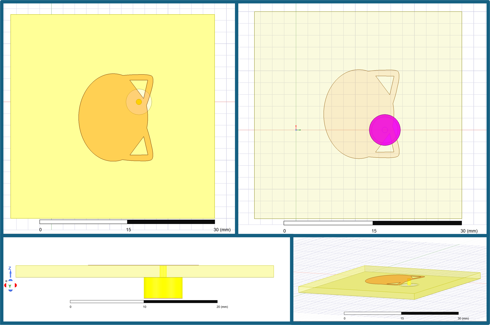

# research_antenna_collection
Collected measurements and designs for antennas that have appeared in papers

## Table of Contents
* [Cat Antennas](#cat-antennas)
* [Related Publications and Repositories](#related-publications-and-repositories)

## Cat Antennas

 

These antennas are modified oval patched on double-sided copper FR4 with permittivity of ~4.4. They are designed to operate at two independent and tunable frequencies. 

**General design summary:**
* Probe-fed design with full copper ground plane
* The two frequencies are independently tunable
    * One frequency is from cheek-to-cheek
    * The second frequency is from head-to-chin
* Little preference is shown in simulation for which orientation is the lower frequency
* Variation in solder 'calico spots' do not impact the design
* Design is impacted more by the probe location in relation to the left ear
* The dual frequencies are better balanced on a round ground plane (not unexpected)
    * Hand cut and milled board outlines measured similarly

<table>
  <tr>
    <td align="center"></td>
    <td align="center"></td>
    <td align="center"></td>
  </tr>
  <tr>
    <td align="center">S11 of 2.4 GHz and 5.8 GHz Design</td>
    <td align="center">S11 of 5 GHz and 6 GHz Design, Square Ground Plane</td>
    <td align="center">S11 of 5 GHz and 6 GHz Design, Round Ground Plane</td>
  </tr>
</table>

All designs show strong consistency between samples. For comparison purposes, all samples were measured from 1 GHz to 8 GHz on a Keysight N5227B PNA Network Analyzer on the same 12-port. In the provided sample .csv files, ports 3 and 4 were used for measurements. S11 in this example is S33.  

In the plot above on the left, the 2.4 GHz and 5.8 GHz (or 6 GHz, it did trend a little high in this group) frequencies are controllable and were designed in simulation. The additional resonances at 4.7 GHz and 7.9 GHz are not directly controllable, but are consistent. 

The center and the third plots are designed for dual-band 5 GHz and 6 GHz frequencies. The designs differ only in the shape of the substrate and ground plane (the ground plane fully covers the back of the substrate). The center plot uses the square ground plane; this design notably has a weaker lower frequency, which is consistent across the samples. This was noticed with the smaller cut of this particular design. The performance is improved with one of 2 changes: 1. extending the ground plane by at least several millimeters, OR 2. moving the probe location slightly to account for the smaller ground plane. 

On the right, a round ground plane is used. The conductor design is the same as the one used on the center plot, and both operate at 5 GHz and 6 GHz, but the round substrate and ground plane combination has a notable improvement in both bands. Moving the probe location slightly in simulation can be used to adjust the return loss for both bands, or to favor one over the other.

The figure immediately below shows several views of the patch antenna on a square ground plane in Ansys HFSS 2022. 

 

Previous literature examples ("Machine Learning Assisted Optimization for Calculation and Automated Tuning of Antennas" [2], 2024), featured planar designs where the probe feed was hand-drilled after using an LPKF ProtoMat S103 to mill out the designs from doulbe-sided FR4. This hand-drilled feed caused issues with balancing the return loss of the 5 GHz and 6 GHz frequencies, and it impacted the gain measured in an ETS Lindgren anechoic chamber (part of the ETS-Lindgren Antenna Measurement System (AMS)-8100) with a Keysight VNA. 

The simulation results in the figure above (left) are the same as the recently (July. 2025) milled designs. The change in quality is due to using an LPKF ProtoLaser with milling capabilities to drill the probe location, etch the conductor layer, and cut the board outline in the same process. Removing the hand-drilling for the probe location was the primary improvement.

<table>
  <tr>
    <td align="center"></td>
    <td align="center"></td>
  </tr>
  <tr>
    <td align="center">Simulated Dual-band Gain and S11 Summary from Literature[2] (First Iteration)</td>
    <td align="center">Measured Dual-band Gain and S11 Summary from Literature[2] (First Iteration)</td>
  </tr>
</table>

Gain measurement of the newly milled antennas is scheduled for late August in order to compare those results to the 2024 results featured in lit.

**Build of materials & assembly suggestions:**

The .DXF files for several of these designs is included in the `dxf_files\cat_antennas` directory.

* FR4
  * Recommended: MG Chemicals 555 Copper Clad Board, Double Sided, 12" x 12", 1 oz Copper, 1/16" Thick, FR4 
  * https://www.amazon.com/MG-Chemicals-Copper-Board-Double/dp/B008OAFNWS?th=1
  * FR4 with a permittivity of ~4.4 was used in the simulation and design. We typically use this brand because it has been consistent in quality.
* SMA connector
  * Recommended: 25PCS SMA Female PCB Panel Edge Mount Plug with 4 Pins Stand Straight Connector RF Coax Coaxial Adapter 
  * https://www.amazon.com/bnafes-Straight-Connector-Coaxial-Adapter/dp/B09N1RBBFX/ 
  * Get the cheap, standard ones. 1 center pin, 4 ground pins either on the corners or placed for easy PCB mount. Remove the ground pins (use a pair of pliers and rolling motion) so that the center pin will go through the hole in the antenna design (the circle by the ear), and the outer connector of the SMA is flush against the ground plane.
* 1/4th inch drill bit for a hand-held drill
  * Recommended: DEWALT 21 -Piece Assorted x Titanium nitride coated HSS Jobber length Twist Drill Bit Set
  * https://www.lowes.com/pd/DEWALT-21-Piece-Titanium-Twist-Drill-Bit-Set/1000438399
  * This drill bit is used to drill the ground plane away from the center of the SMA connector so that there is no contact between the center pin and ground. The copper can be removed by hand, but the drill is fast and consistent. Do NOT drill deeply into the FR4.
  * When selecting a drill bit, other sizes can be used as long as the ground (outside) of the SMA can be soldered to the ground plane of the antenna. 
* Lead solder
  * Recommended, Any brand works. Lead solder will flow better without additional flux and attach to the copper easier
* A pair of side/diagonal cutters
  * Any brand works as long as the extra length of the center pin can be cut flush with the conductor side of the antenna (the cat face) before soldering. WEAR SAFETY GOGGLES. When cutting the excess center pin, the metal tends to launch outward.

## Related Publications and Repositories

**Cat Antennas**

[1] L. Linkous, J. Lundquist, M. J. Suche and E. Topsakal, "AntennaCAT: Automated antenna design with machine learning-assisted optimization [Open Source]," in IEEE Antennas and Propagation Magazine, vol. 67, no. 3, pp. 87-96, June 2025, doi: 10.1109/MAP.2025.3560851

[2] L. Linkous, “Machine Learning Assisted Optimization for Calculation and Automated Tuning of Antennas,” VCU Scholars Compass, 2024, doi: https://doi.org/10.25772/ND02-0830.

[3] L. Linkous and E. Topsakal, "Machine Learning Assisted Optimization Methods for Automated Antenna Design," 2024 United States National Committee of URSI National Radio Science Meeting (USNC-URSI NRSM), Boulder, CO, USA, 2024, pp. 377-378, doi: 10.23919/USNC-URSINRSM60317.2024.10464597.

[4] L. Linkous, J. Lundquist and E. Topsakal, "AntennaCAT: Automated Antenna Design and Tuning Tool," 2023 IEEE USNC-URSI Radio Science Meeting (Joint with AP-S Symposium), Portland, OR, USA, 2023, pp. 89-90, doi: 10.23919/USNC-URSI54200.2023.10289238.

[5] L. Linkous, E. Karincic, J. Lundquist and E. Topsakal, "Automated Antenna Calculation, Design and Tuning Tool for HFSS," 2023 United States National Committee of URSI National Radio Science Meeting (USNC-URSI NRSM), Boulder, CO, USA, 2023, pp. 229-230, doi: 10.23919/USNC-URSINRSM57470.2023.10043119.

